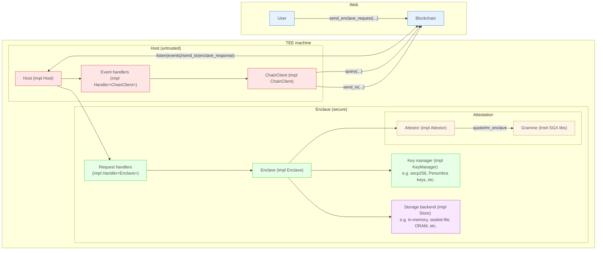

# Building Applications

Quartz is a framework for building private applications using TEEs. 
It allows app devs to establish secure communication with TEEs
and to manage what codes run on what data, and when. 

---
WARNING:

Quartz provides utilities for secure communication with TEEs,
but it DOES NOT specify a data model for applications. This gives application
devs great power and flexibility, but with this power comes great
responsibility. App devs must remain diligent to ensure their data model does
not leak private information (or leaks only what they are comfortable with). 

The Quartz framework intends to provide better tools and patterns for securely
working with private data, for instance via ORAM.

---

With Quartz, app devs write code for two kinds of environments: smart contracts and TEEs. 

For now, smart contract code is written in CosmWasm Rust and deployed on Cosmos-SDK chains that support CosmWasm.
TEE code is written in Rust and compiled via Gramine to run on Intel SGX enclaves.

App devs need to design their smart contracts and their enclave code in tandem to work together. 
Note that enclave code is not restricted to be CosmWasm, but can be (practically) arbitrary Rust.

See the [transfers app][transfers_app] for a very simplistic example of a quartz
application.

For background on basic TEE components and how Quartz works, see [How it
Works][how_it_works].

# System component diagram

## Smart Contract Code

A Quartz smart contract must specify:

- how private requests are queued for TEE execution 
- how private state is managed
- how TEE responses (both public and private) are executed 
- how TEE operators are managed and authorized

Private requests should be encrypted to authorized TEE keys and queued for
execution at some frequency by the TEE.

Private state should be managed in such a way that accessing/updating it does
not unnecessarily leak private information.

Public responses can be executed directly on-chain (e.g. public balance
changes), while private responses can be executed by verifying remote
attestations and zero-knowledge proofs generated by the TEE. App devs must take
care that execution of responses does not accidentally leak more information
than they desire.

TEE operators and the code they run should be managed via some registration procedure. 
The code should be built via reproducible build procedure and reliable operators
should be selected. Ensuring operators are running on trusted cloud
infrastructure providers can provide additional mitigations against the risk of
physical attacks on the machine. For more on reproducible builds, see the work
of [Poetic Technologies][poetic].

Like any CosmWasm application, a Quartz application defines a set of messages
and handlers for them.

Quartz provides message types and handlers for the handshake messages to
abstract them away from developers. It also provides types to specify that
certain messages should include a remote attestation (RA) that must be verified.

As noted in [How it Works][how_it_works], RA depends on info about the Trusted Computing
Base (TCB). This is implemented as a separate TCBInfo contract. The TCBInfo
contract is a public good that can be used by many different instances of
Quartz, and a production version is best instantiated and maintained on a
central coordination blockchain (e.g. the Cosmos Hub). This is similar to the
[on-chain PCCS contract from Automata][automata-pccs]. Note that the TCBInfo is the most security critical subset of
the PCCS and the part that is most likely to need updating. 

DCAP verification is also implemented as its own independent contract, to reduce
contract code size. Verification is thus performed by calling the DCAP contract.

## Enclave Code

A Quartz enclave must listen for events from the blockchain to act upon. Quartz
provides a websocket handler for doing so. App devs can define what events to
listen for and how to respond to them (this must be coordinated with the events
emitted by their smart contract).

The enclave code must then specify what data is to be fetched from the
blockchain for execution. This data must be verified via light client proofs.
It is the app dev's responsibility to ensure these proofs are correctly fetched and
verified. This ensures the enclave has permission from the contract to execute specific data. It can also ensure
that the enclave operates on a full set of data (ie. no requests were
excluded), providing censorship resistance.

The enclave code can then decrypt data and execute according to
app-specific logic. 

Enclaves can maintain their own local private state through SGX sealed files.
More direct support for sealed files in the Quartz framework remains for future
work.

The enclave code can then produce a remote attestation of the result, and
optionally a zero-knowledge proof (ZKP) of execution.

For more details on the API and its usage, refer to the crate-level documentation of the core enclave crate. 

[transfers_app]: /examples/transfers
[how_it_works]: /docs/how_it_works.md
[poetic]: https://poeticte.ch/
[automata-pccs]: https://blog.ata.network/bringing-intel-sgx-pccs-on-chain-d5917878bf54
